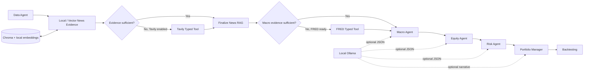

# LangGraph Multi-Agent Stock Research Workflow

A Python prototype for auditable stock research and selection. A typed LangGraph state moves through data ingestion, news retrieval, macro analysis, equity analysis, risk review, portfolio construction, and forward-return evaluation.

The default demo is deterministic, credential free, and based on six fictional stocks. Optional integrations add live KRX/U.S. market data, Tavily news, Chroma retrieval, local Sentence Transformers embeddings, FRED macro observations, and local Ollama reasoning.

> Engineering demonstration only. The generated output is not investment advice or a recommendation to trade.

## Highlights

- **LangGraph orchestration:** seven domain stages plus explicit evidence checks and conditional tool branches over one `StockPickerState`
- **Evidence-based routing:** deterministic rules skip Tavily and FRED when existing evidence is sufficient
- **Typed external tools:** Tavily and FRED calls share a `ToolResult` contract and export a secret-safe invocation audit
- **Financial data ingestion:** CSV, pykrx, and yfinance provider adapters
- **News RAG:** normalization, company matching, quality filtering, near-duplicate removal, ticker-scoped retrieval, and Chroma persistence
- **Financial analysis agents:** macro, equity, risk, and portfolio responsibilities are separated
- **LLM integration:** optional structured JSON generation through a local Ollama server, with deterministic fallback
- **Evaluation and audit:** financial data checks, score traces, news quality reports, and forward-return checks
- **Public safety:** secrets are environment-only, config files reject secret-like fields, and report exports recursively mask sensitive metadata

## Architecture



See [docs/architecture.md](docs/architecture.md) for node responsibilities and implementation boundaries.

## Quick start: offline demo

Python `3.10` through `3.12` is supported.

```bash
python -m venv .venv
# Windows PowerShell: .venv\Scripts\Activate.ps1
# macOS/Linux: source .venv/bin/activate
python -m pip install --upgrade pip
python -m pip install -e .
python -m stock_picker.main --config data/demo_run.json
```

The demo reads [data/sample_universe.csv](data/sample_universe.csv), makes no external API calls, and writes generated reports under `outputs/offline_demo/`. A sanitized example is available at [examples/offline_demo_report.md](examples/offline_demo_report.md).

## Optional integrations

Install only what the selected workflow needs:

```bash
# Chroma, Tavily, and local embedding models
python -m pip install -e ".[rag]"

# pykrx, yfinance, and universe HTML parsing
python -m pip install -e ".[live-data]"

# All optional integrations
python -m pip install -e ".[all]"
```

`requirements.txt` is the bounded full installation for environments that prefer requirements files.

### Environment variables

Copy `.env.example` to `.env` and fill only the services you intend to use:

```env
FRED_API_KEY=
TAVILY_API_KEY=
HF_TOKEN=
OLLAMA_BASE_URL=http://127.0.0.1:11434
OLLAMA_MODEL=gemma:7b
```

Secrets must not be placed in JSON config files. The loader rejects keys such as `api_key`, `token`, `secret`, `password`, and `credential`. FRED and Tavily credentials are read from the environment only and are never added to LangGraph state.

### Local Ollama

```bash
python -m stock_picker.ollama_smoke_test --config data/ollama_run.json
python -m stock_picker.main --config data/ollama_run.json
```

For this local CLI prototype, `ollama_base_url` is restricted to loopback HTTP hosts such as `127.0.0.1` and `localhost`. If Ollama or the model is unavailable, agents record a safe failure and use deterministic logic.

### FRED macro input

Set `FRED_API_KEY` in `.env` or the process environment. A local config may then select `"macro_mode": "fred"` and provide only a non-secret `fred_series_map`. The key itself must remain outside the config.

### Full-universe example

The repository does not redistribute an S&P 500 or KOSPI 200 constituent snapshot. Generate current CSVs from the fixed public Wikipedia source pages, then start the public full-run config:

```bash
python -m pip install -e ".[live-data]"
python scripts/build_full_universes.py
python -m stock_picker.main --full-mode
```

`--full-mode` loads `data/full_run.example.json`. It uses pykrx and yfinance at runtime, may take substantial time, and remains subject to upstream availability and source-page changes. Generated universe, feature, and price files are ignored by Git.

## Testing

No API key, paid service, network call, Ollama server, or vector database is required for the test suite.

```bash
python -m compileall .
python -m stock_picker.main --help
python -m unittest discover -s tests -v
```

GitHub Actions runs compilation, import validation, and the complete unit suite on Python 3.10 and 3.12.

## Project structure

```text
.
|-- .github/workflows/ci.yml
|-- data/
|   |-- demo_run.json              # credential-free offline config
|   |-- ollama_run.json            # optional local LLM config
|   |-- full_run.example.json      # optional generated-universe/live-data config
|   |-- sample_macro_context.json
|   `-- sample_universe.csv        # synthetic data only
|-- docs/architecture.md
|-- examples/offline_demo_report.md
|-- scripts/build_full_universes.py
|-- src/stock_picker/
|   |-- agents/
|   |-- data_providers/
|   |-- providers/
|   |-- graph.py
|   |-- news_rag.py
|   |-- news_vectorstore.py
|   |-- security.py
|   `-- main.py
`-- tests/
```

## Security and data notes

- `.env`, credentials, local databases, vector indexes, embeddings, downloaded data, reports, caches, and IDE files are excluded by `.gitignore`.
- Report JSON, step summaries, forward-test snapshots, and CSV exports sanitize nested secret-like fields before serialization.
- Runtime paths under the project or user home directory are generalized in exported metadata.
- FRED and universe-builder URLs are fixed or host allowlisted and use bounded timeouts.
- Tavily and yfinance failures return controlled status information without logging credentials.
- The included stock universe and macro context are synthetic. No proprietary or customer financial dataset is included.
- Current market constituent lists are generated at runtime from public pages; users remain responsible for the source terms and data use.

## Design choices

### Deterministic baseline with optional LLM reasoning

The ranking pipeline remains runnable without an LLM. This provides a stable baseline and keeps failure behavior observable. Ollama contributes structured analysis when explicitly enabled.

### Evidence-focused retrieval

News is normalized into a common schema, checked for company relevance and freshness, deduplicated, and retrieved with ticker metadata filters. Quantitative price features are deliberately excluded from the qualitative news index.

### Auditable output

Each node emits a compact summary. Final reports preserve score components, selected and rejected names, risk reasons, evidence coverage, and known limitations.

## Limitations

- Conditional edges currently cover Tavily news retrieval and FRED macro retrieval. The graph does not yet implement parallel fan-out, checkpointing, or human approval nodes.
- The project uses a direct Ollama HTTP adapter. Native function calling, LangGraph `ToolNode`, and MCP are not implemented.
- Live providers can return incomplete, delayed, or revised data.
- News quality and company matching use heuristic rules; there is no labeled retrieval evaluation set yet.
- The backtesting component performs forward-return checks over supplied snapshots. It is not a full walk-forward portfolio simulator and does not model execution or transaction costs.

## Future work

1. Add bounded retry and evidence refresh policies to the existing deterministic routes.
2. Add a labeled retrieval set with recall at k and MRR.
3. Add leakage-controlled rolling backtests, costs, and benchmark comparisons.
4. Add an API layer after workflow contracts and evaluation are stable.

## License

MIT
