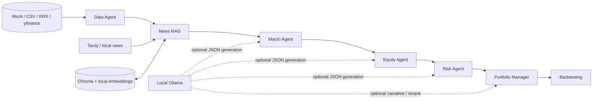

# Architecture

## Workflow

`StockPickerState` is the shared typed state. Each LangGraph node reads the fields it needs, writes its result back to state, and exports a compact step summary for inspection.

## Node responsibilities

| Node | Input | Output | Main behavior |
|---|---|---|---|
| Data Agent | universe and provider config | ranked shortlist | validates features and applies value, quality, momentum, and liquidity filters |
| News RAG | shortlist and news config | grounded news context | loads local/API news, filters quality, retrieves by ticker, and optionally stores embeddings in Chroma |
| Macro Agent | structured macro context | regime and sector view | produces a rule based view or an Ollama generated JSON result |
| Equity Agent | shortlist, news, macro view | stock theses | evaluates strengths, weaknesses, catalysts, and evidence gaps |
| Risk Agent | candidates and prior analyses | risk views | assigns risk levels and records major risk drivers |
| Portfolio Manager | all prior analyses | top picks and rejections | combines quantitative scores, macro adjustments, risk penalties, and optional LLM output |
| Backtesting | final picks and price history | evaluation summary | calculates forward returns when a compatible price snapshot is supplied |

## RAG path

The news path normalizes documents, rejects weak or mismatched company evidence, removes near duplicates, and retrieves ticker scoped documents from Chroma. Embeddings use a local Sentence Transformers model. Tavily and yfinance are optional acquisition sources. Quantitative price features are intentionally excluded from the semantic news index.

## Current boundaries

- The graph is a sequential `StateGraph`; it does not yet use conditional routing, parallel fan out, checkpointing, or human approval nodes.
- Ollama is called through a small HTTP JSON adapter. The project does not claim native function calling, `ToolNode`, or MCP support.
- The included offline demo uses synthetic data. Real KRX and US market adapters exist, but live behavior depends on upstream data availability.
- Backtesting is a forward return check over supplied snapshots, not a production grade rolling strategy simulator.
