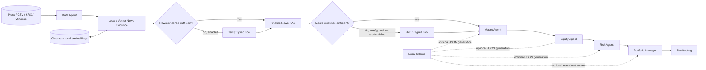

# Architecture

## Workflow

`StockPickerState` is the shared typed state. Each LangGraph node reads the fields it needs, writes its result back to state, and exports a compact step summary for inspection.

## Node responsibilities

| Node | Input | Output | Main behavior |
|---|---|---|---|
| Data Agent | universe and provider config | ranked shortlist | validates features and applies value, quality, momentum, and liquidity filters |
| News Evidence | shortlist and news config | scored local/vector evidence | loads local and existing news, filters quality, retrieves by ticker, and optionally stores embeddings in Chroma |
| News Evidence Check | scored documents | deterministic route | compares usable article coverage with the configured target and checks whether Tavily is enabled |
| Tavily Typed Tool | candidates with evidence gaps | normalized external news | wraps the existing Tavily provider in a common result contract and never stores its credential |
| Macro Evidence Check | structured macro config | deterministic route | verifies four required signals before considering FRED mode, series configuration, and credential availability |
| FRED Typed Tool | configured series map | normalized macro context | wraps the existing FRED provider and returns only structured observations and safe metadata |
| Macro Agent | structured macro context | regime and sector view | produces a rule based view or an Ollama generated JSON result |
| Equity Agent | shortlist, news, macro view | stock theses | evaluates strengths, weaknesses, catalysts, and evidence gaps |
| Risk Agent | candidates and prior analyses | risk views | assigns risk levels and records major risk drivers |
| Portfolio Manager | all prior analyses | top picks and rejections | combines quantitative scores, macro adjustments, risk penalties, and optional LLM output |
| Backtesting | final picks and price history | evaluation summary | calculates forward returns when a compatible price snapshot is supplied |

## RAG path

The news path normalizes documents, rejects weak or mismatched company evidence, removes near duplicates, and retrieves ticker scoped documents from Chroma. Embeddings use a local Sentence Transformers model. Tavily and yfinance are optional acquisition sources. Quantitative price features are intentionally excluded from the semantic news index.

The routing target defaults to `news_retrieval_top_k` usable articles per eligible ticker and can be set separately with `news_external_min_usable_articles`. "Usable" means that an article survived the existing freshness, company relevance, and low quality filters and meets `news_min_quality_score`. Tavily is skipped when every eligible ticker meets the target or when the integration is disabled.

## Typed tools and audit trail

`TavilyNewsSearchTool` and `FredMacroTool` adapt existing providers to the same `ToolResult` contract: tool name, success, result, error category, and non-sensitive metadata. The wrapper contains no API key, authorization header, or provider exception text. Each route writes a `tool_audit_trail` entry whether the tool ran or was deliberately skipped. News and macro step summaries include the relevant entries, and the existing export sanitizer remains the final serialization boundary.

FRED routing first checks for the four structured signals: growth, inflation, policy, and volatility. If they are absent, FRED is considered only when `macro_mode` is `fred`, a nonempty `fred_series_map` exists, and `FRED_API_KEY` is available in the environment. The credential is checked for availability only and never enters state.

Both decisions are rule based so the same state produces the same route and unit tests can cover every branch. An external failure records a category such as `network_error`, keeps available evidence, and lets the workflow continue. A failed FRED call produces an explicit insufficient macro result instead of silently retrying the provider.

## Current boundaries

- Conditional routing is limited to external news and macro acquisition. Analysis and portfolio stages remain intentionally sequential.
- The typed wrappers are local Python interfaces. They do not claim native function calling, LangGraph `ToolNode`, MCP, or LLM based routing.
- The graph does not yet use parallel fan out, checkpointing, or human approval nodes.
- Ollama is called through a small HTTP JSON adapter.
- The included offline demo uses synthetic data. Real KRX and US market adapters exist, but live behavior depends on upstream data availability.
- Backtesting is a forward return check over supplied snapshots, not a production grade rolling strategy simulator.
